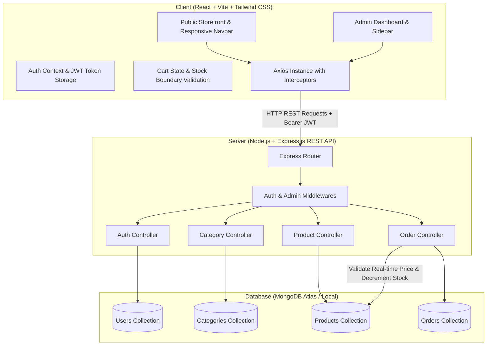
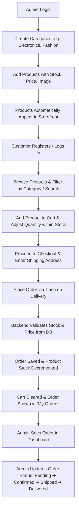

# 🛒 Mini E-Commerce Demo (MERN Stack)

A lightweight, modern, and production-ready **Mini E-Commerce Demo Project** built using the **MERN Stack** (MongoDB, Express.js, React.js, Node.js) with Tailwind CSS styling and JWT-based role authentication.

---

## 📌 Table of Contents

- [Overview](#-overview)
- [Tech Stack](#-tech-stack)
- [System Architecture](#-system-architecture)
- [Project Directory Structure](#-project-directory-structure)
- [Core Features](#-core-features)
- [End-to-End Demo Flow](#-end-to-end-demo-flow)
- [Scope Boundaries](#-scope-boundaries)
- [Documentation Index](#-documentation-index)
- [Implementation Roadmap](#-implementation-roadmap)

---

## 🌟 Overview

The goal of this project is to implement a clean, cohesive, and fully functional Mini E-Commerce Web Application without bloat. It features two core user experiences:
1. **Public Storefront**: Allows visitors to browse products, search by keyword, filter by categories, add items to cart (with strict real-time stock limits), register/login, and place orders via **Cash on Delivery (COD)**.
2. **Admin Dashboard**: A secure, role-protected interface for store administrators to manage categories, products (with inventory control), and track/update customer order lifecycles in real time.

---

## 🛠 Tech Stack

| Layer | Technology | Description |
| :--- | :--- | :--- |
| **Frontend** | React 18 + Vite | High-performance SPA with client-side routing |
| **Styling** | Tailwind CSS | Utility-first, clean, modern, fully responsive UI |
| **Icons & UI** | Lucide React | Clean, lightweight SVG iconography |
| **Backend** | Node.js + Express.js | Scalable REST API with modular controllers and routers |
| **Database** | MongoDB + Mongoose | Document datastore with schema validation and indexing |
| **Authentication** | JWT + bcryptjs | Stateless authorization with password hashing |
| **HTTP Client** | Axios | Configured with base URLs and JWT bearer interceptors |

---

## 🏛 System Architecture



---

## 📂 Project Directory Structure

```text
E-comm/
├── README.md                  # Project overview, architecture, and quickstart
├── docs/                      # Comprehensive technical documentation
│   ├── REQUIREMENTS.md        # Detailed functional & non-functional specifications
│   ├── ARCHITECTURE.md        # System design, state management, & security layers
│   ├── DATABASE_SCHEMA.md     # Mongoose models, data dictionaries, & ER diagrams
│   ├── API_SPECIFICATION.md   # Complete REST API reference with payload schemas
│   ├── UI_UX_DESIGN.md        # Wireframes, layout breakdown, & Tailwind design tokens
│   ├── DEMO_FLOW.md           # Step-by-step walkthrough of the complete demo
│   └── SETUP_GUIDE.md         # Environment setup, seeding, and execution guide
├── client/                    # React Frontend (Vite)
│   ├── public/
│   ├── src/
│   │   ├── api/               # Axios instance and API call functions
│   │   ├── assets/            # Static media and placeholder fallbacks
│   │   ├── components/        # Reusable UI (Navbar, Footer, Modal, Toast, Cards)
│   │   ├── context/           # AuthContext & CartContext
│   │   ├── layouts/           # MainLayout (Storefront) & AdminLayout (Dashboard)
│   │   ├── pages/             # Storefront & Admin page components
│   │   ├── App.jsx            # Route definitions
│   │   ├── index.css          # Tailwind CSS directives & root styles
│   │   └── main.jsx           # App bootstrapping
│   ├── index.html
│   ├── package.json
│   ├── tailwind.config.js
│   └── vite.config.js
└── server/                    # Node.js + Express Backend
    ├── config/                # Database connection & environment configs
    ├── controllers/           # Request handlers for auth, categories, products, orders
    ├── middleware/            # JWT verification, Admin role check, error handling
    ├── models/                # Mongoose schemas: User, Category, Product, Order
    ├── routes/                # Express router endpoints
    ├── utils/                 # Seed scripts and helper functions
    ├── .env.example
    ├── package.json
    └── server.js              # Application entrypoint
```

---

## ⚡ Core Features

### 1. Authentication & Roles
- **Customer Registration**: Validation for Name, Email, Password, and Confirm Password (min 6 characters, unique email check).
- **Secure Login**: JWT token issuance with bcrypt-hashed passwords.
- **Role-Based Access Control**: Standard `customer` role vs elevated `admin` role.
- **Protected Routes**: Backend middleware verifies token signatures and admin privileges.

### 2. Admin Management Panel
- **Category Management**: Create, Read, Update, and Delete product categories.
- **Product Inventory Management**: Add, edit, remove products with image URL, description, category selector, price, and real-time stock counts.
- **Order Tracking**: Review all incoming customer orders and transition statuses: `Pending` ➔ `Confirmed` ➔ `Shipped` ➔ `Delivered` (or `Cancelled`).

### 3. Customer Storefront
- **Dynamic Catalog**: Responsive grid displaying products with real-time stock indicators.
- **Search & Filtering**: Live text search + category filter pills (`All`, `Electronics`, `Fashion`, etc.).
- **Product Details**: Dedicated page with detailed descriptions and stock limits.
- **Smart Shopping Cart**: Quantity adjustments bound strictly by available inventory; prevents overselling.
- **Checkout (COD)**: Shipping address entry, server-side price validation, atomic stock decrement, and cart clearance.
- **My Orders**: Dedicated order history view for authenticated customers.

---

## 🔄 End-to-End Demo Flow



---

## 🚫 Scope Boundaries

To preserve clarity, focus, and rapid execution as a clean MERN demo project:

| Included in Scope ✅ | Explicitly Excluded ❌ |
| :--- | :--- |
| JWT Authentication & bcrypt hashing | Third-party OAuth (Google, GitHub) |
| Customer & Admin roles | Multi-vendor / Seller portals |
| Category & Product CRUD | Product variants (size, color matrices) |
| Search & Category query filtering | Algolia / Elasticsearch engine |
| In-memory / LocalStorage Shopping Cart | Persistent server-side cart sync |
| Real-time stock validation & decrement | Payment gateways (Stripe, Razorpay, PayPal) |
| Cash on Delivery (COD) Checkout | Coupon codes & discount engines |
| Order lifecycle status updates | Complex logistics / shipping APIs |
| Responsive Tailwind UI with Toast feedback | Customer product reviews & ratings |

---

## 📚 Documentation Index

Detailed specifications and architectural guides are available in the [`docs/`](./docs) folder:

1. [**Requirements Specification** (`docs/REQUIREMENTS.md`)](./docs/REQUIREMENTS.md) - Complete functional & non-functional requirements.
2. [**System Architecture** (`docs/ARCHITECTURE.md`)](./docs/ARCHITECTURE.md) - Component design, data flow, middlewares, and sequence diagrams.
3. [**Database Schema Design** (`docs/DATABASE_SCHEMA.md`)](./docs/DATABASE_SCHEMA.md) - MongoDB Mongoose schemas, data types, indexes, and validation rules.
4. [**API Specification** (`docs/API_SPECIFICATION.md`)](./docs/API_SPECIFICATION.md) - REST API contracts, request payloads, response bodies, and HTTP status codes.
5. [**UI/UX Design & Layouts** (`docs/UI_UX_DESIGN.md`)](./docs/UI_UX_DESIGN.md) - Wireframes, Tailwind design tokens, responsive breakpoints, and UI states.
6. [**Demo Flow Guide** (`docs/DEMO_FLOW.md`)](./docs/DEMO_FLOW.md) - Detailed step-by-step walkthrough script for the entire demo workflow.
7. [**Setup & Installation Guide** (`docs/SETUP_GUIDE.md`)](./docs/SETUP_GUIDE.md) - Environment configurations, seed script guide, and local execution instructions.
8. [**Task Assignments & Work Breakdown** (`docs/TASK_ASSIGNMENTS.md`)](./docs/TASK_ASSIGNMENTS.md) - Modular 14-task assignment matrix with acceptance criteria.

---

## 🚀 Implementation Roadmap

- [x] Phase 1: Architecture & Technical Documentation Specification
- [ ] Phase 2: Backend Development (Node.js, Express, MongoDB schemas, JWT auth, APIs)
- [ ] Phase 3: Database Seeder Script (Initial Admin & Sample Catalog)
- [ ] Phase 4: Frontend Development (Vite, React, Tailwind CSS, Auth & Cart Contexts)
- [ ] Phase 5: Admin Dashboard UI & Management Workflows
- [ ] Phase 6: Public Storefront, Search, Filter, Cart, & COD Checkout
- [ ] Phase 7: End-to-End Integration Testing & Validation