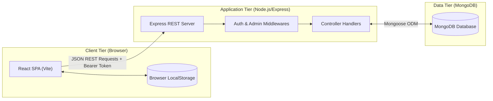
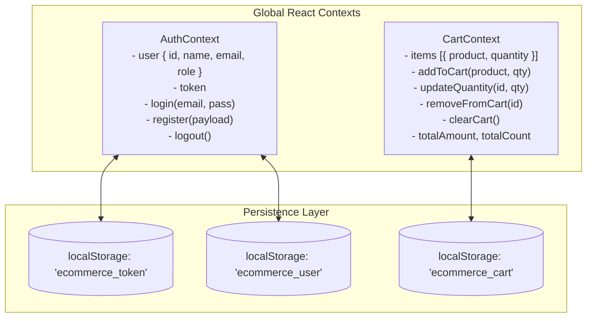
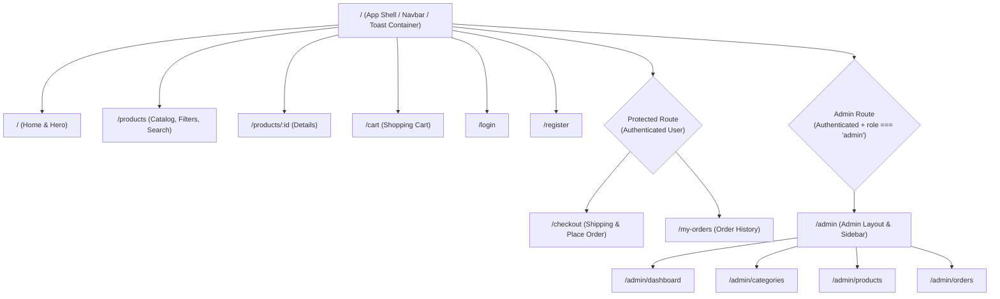
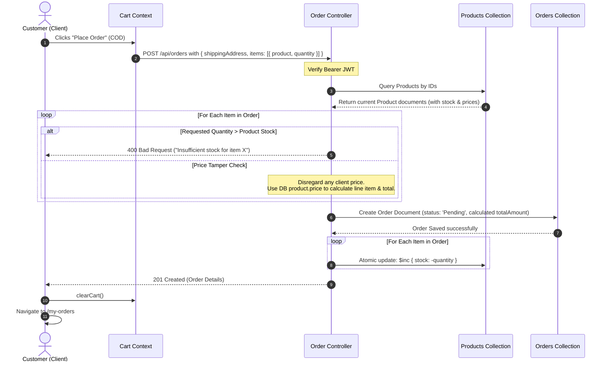
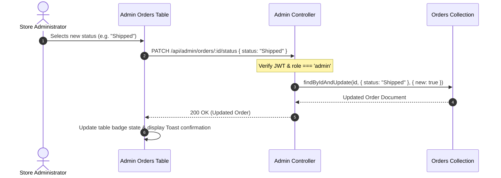

# 🏗 System Architecture

This document provides a comprehensive technical overview of the architecture, design patterns, data flows, and security mechanics of the **Mini E-Commerce Demo Project**.

---

## 1. High-Level System Overview

The system is constructed as a decoupled **Single Page Application (SPA)** client communicating with a stateless **REST API** backend over JSON over HTTPS.



---

## 2. Frontend Architecture (`/client`)

### 2.1 Technology Stack & Utilities
- **Framework**: React 18 using Vite for fast HMR and optimized production bundles.
- **Routing**: `react-router-dom` v6 with declarative nested routes and protected route guards.
- **Styling**: Tailwind CSS with tailored utility classes, custom color tokens, and responsive utilities.
- **Icons**: `lucide-react` for clean, consistent UI iconography.
- **HTTP Client**: `axios` instance pre-configured with interceptors.
- **Notifications**: Lightweight toast component / `react-hot-toast` for non-blocking visual feedback.

### 2.2 Client State Architecture



### 2.3 Route Guard Hierarchy



### 2.4 Axios Interceptor Design

The centralized `api/axios.js` client automatically decorates outgoing requests and centralizes authentication failures:

```javascript
// Request Interceptor: Injects Authorization Header
axiosInstance.interceptors.request.use((config) => {
  const token = localStorage.getItem('ecommerce_token');
  if (token) {
    config.headers.Authorization = `Bearer ${token}`;
  }
  return config;
});

// Response Interceptor: Catches 401 Unauthorized
axiosInstance.interceptors.response.use(
  (response) => response,
  (error) => {
    if (error.response?.status === 401) {
      localStorage.removeItem('ecommerce_token');
      localStorage.removeItem('ecommerce_user');
      window.location.href = '/login';
    }
    return Promise.reject(error);
  }
);
```

---

## 3. Backend Architecture (`/server`)

### 3.1 Layered Express Architecture

The backend adheres to a clean separation of concerns:

```text
Incoming Request
      │
      ▼
┌──────────────┐
│  Middleware  │  --> CORS, JSON Body Parser, AuthMiddleware, AdminMiddleware
└──────┬───────┘
       ▼
┌──────────────┐
│    Router    │  --> Route declarations (e.g. /api/products, /api/orders)
└──────┬───────┘
       ▼
┌──────────────┐
│  Controller  │  --> Request validation, business logic, response formatting
└──────┬───────┘
       ▼
┌──────────────┐
│ Model / ODM  │  --> Mongoose Schemas with type checks, hooks, and indexes
└──────┬───────┘
       ▼
┌──────────────┐
│   MongoDB    │  --> Document storage
└──────────────┘
```

### 3.2 Authentication & Authorization Pipeline

1. **Token Generation**: Upon successful login or registration, the server signs a JWT token using `process.env.JWT_SECRET`:
   ```javascript
   const token = jwt.sign(
     { id: user._id, role: user.role },
     process.env.JWT_SECRET,
     { expiresIn: '7d' }
   );
   ```
2. **`authMiddleware`**:
   - Extracts the token from `req.headers.authorization`.
   - Verifies the signature using `jwt.verify`.
   - Fetches the user record or attaches `{ id, role }` to `req.user`.
   - Returns `401 Unauthorized` if token is missing, expired, or invalid.
3. **`adminMiddleware`**:
   - Executes after `authMiddleware`.
   - Verifies that `req.user.role === 'admin'`.
   - Returns `403 Forbidden` if user is not an administrator.

---

## 4. End-to-End Sequence Diagrams

### 4.1 Customer Checkout & Order Placement Sequence

This sequence highlights **server-side price validation** and **atomic stock reduction**:



### 4.2 Admin Order Status Transition Sequence



---

## 5. Security & Threat Mitigation Architecture

| Threat / Vulnerability | Mitigation Strategy |
| :--- | :--- |
| **Client-side Price Manipulation** | The server completely ignores any price sent in request payloads. Prices are queried freshly from MongoDB and totals are calculated strictly on the backend. |
| **Negative Stock & Race Conditions** | Stock availability is verified prior to order creation. Stock decrements use MongoDB atomic `$inc: { stock: -qty }` with query conditions `{ _id: id, stock: { $gte: qty } }`. |
| **Unauthorized Administrative Actions** | Double-layer middleware guard (`authMiddleware` + `adminMiddleware`). Sensitive routes reject non-admin tokens with `403 Forbidden`. |
| **Password Disclosure** | Passwords hashed using bcrypt (10 rounds). Mongoose schema sets `select: false` on the password field to prevent leakage in query responses. |
| **NoSQL Injection & Parameter Tampering** | Mongoose strict typing and explicit schema validation sanitize and cast parameters before query execution. |
| **Cross-Origin Resource Sharing (CORS)** | Express CORS configured to only allow requests from the designated client URL/port. |
