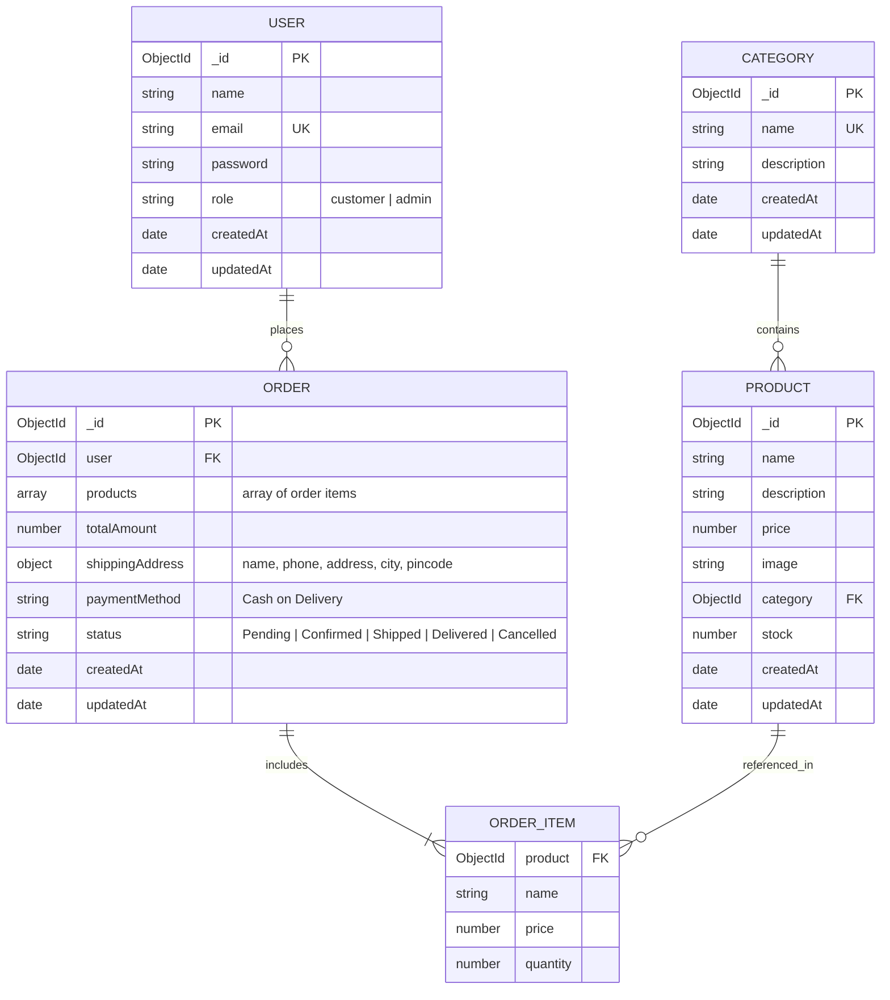

# 🗄 Database Schema Design

This document details the data architecture for the **Mini E-Commerce Demo Project**. The database is implemented using **MongoDB** with strict schema validation provided by **Mongoose**.

---

## 1. Entity-Relationship Diagram (ERD)



---

## 2. Model Specifications

### 2.1 User Model (`User.js`)

Represents registered customers and administrative users.

| Field | Type | Required | Unique | Default | Description & Validation |
| :--- | :--- | :--- | :--- | :--- | :--- |
| `_id` | ObjectId | Auto | Yes | Generated | Primary Key |
| `name` | String | Yes | No | - | Trimmed, 2 to 50 characters |
| `email` | String | Yes | Yes | - | Trimmed, lowercase, valid email regex |
| `password` | String | Yes | No | - | Bcrypt hashed string (min 6 plain characters before hash) |
| `role` | String | Yes | No | `"customer"` | Enum: `["customer", "admin"]` |
| `createdAt` | Date | Auto | No | `Date.now` | Account creation timestamp |
| `updatedAt` | Date | Auto | No | `Date.now` | Last profile update timestamp |

#### Mongoose Schema Reference:
```javascript
const userSchema = new mongoose.Schema(
  {
    name: {
      type: String,
      required: [true, 'Please provide your name'],
      trim: true,
      minlength: [2, 'Name must be at least 2 characters long'],
      maxlength: [50, 'Name cannot exceed 50 characters'],
    },
    email: {
      type: String,
      required: [true, 'Please provide your email'],
      unique: true,
      trim: true,
      lowercase: true,
      match: [
        /^\w+([\.-]?\w+)*@\w+([\.-]?\w+)*(\.\w{2,3})+$/,
        'Please provide a valid email address',
      ],
    },
    password: {
      type: String,
      required: [true, 'Please provide a password'],
      minlength: [6, 'Password must be at least 6 characters'],
      select: false, // Prevents password from being returned in query projections by default
    },
    role: {
      type: String,
      enum: ['customer', 'admin'],
      default: 'customer',
    },
  },
  { timestamps: true }
);

// Pre-save hook: Hash password with bcrypt prior to save
userSchema.pre('save', async function (next) {
  if (!this.isModified('password')) return next();
  const salt = await bcrypt.genSalt(10);
  this.password = await bcrypt.hash(this.password, salt);
  next();
});
```

---

### 2.2 Category Model (`Category.js`)

Defines product classifications used for organization, filtering, and navigation.

| Field | Type | Required | Unique | Default | Description & Validation |
| :--- | :--- | :--- | :--- | :--- | :--- |
| `_id` | ObjectId | Auto | Yes | Generated | Primary Key |
| `name` | String | Yes | Yes | - | Trimmed, e.g. "Electronics", "Fashion", "Shoes" |
| `description` | String | No | No | `""` | Optional details explaining the category |
| `createdAt` | Date | Auto | No | `Date.now` | Timestamp |
| `updatedAt` | Date | Auto | No | `Date.now` | Timestamp |

#### Mongoose Schema Reference:
```javascript
const categorySchema = new mongoose.Schema(
  {
    name: {
      type: String,
      required: [true, 'Category name is required'],
      unique: true,
      trim: true,
      maxlength: [50, 'Category name cannot exceed 50 characters'],
    },
    description: {
      type: String,
      trim: true,
      maxlength: [300, 'Description cannot exceed 300 characters'],
      default: '',
    },
  },
  { timestamps: true }
);
```

---

### 2.3 Product Model (`Product.js`)

Stores item metadata, pricing, inventory stock, and category relationships.

| Field | Type | Required | Unique | Default | Description & Validation |
| :--- | :--- | :--- | :--- | :--- | :--- |
| `_id` | ObjectId | Auto | Yes | Generated | Primary Key |
| `name` | String | Yes | No | - | Product title (3 - 100 characters) |
| `description` | String | Yes | No | - | Detailed description (10 - 1000 characters) |
| `price` | Number | Yes | No | - | Float > 0, currency amount |
| `image` | String | Yes | No | - | Absolute URL or valid image path |
| `category` | ObjectId | Yes | No | - | Reference to `Category` collection |
| `stock` | Number | Yes | No | `0` | Non-negative integer (`min: 0`) |
| `createdAt` | Date | Auto | No | `Date.now` | Timestamp |
| `updatedAt` | Date | Auto | No | `Date.now` | Timestamp |

#### Mongoose Schema Reference:
```javascript
const productSchema = new mongoose.Schema(
  {
    name: {
      type: String,
      required: [true, 'Product name is required'],
      trim: true,
      minlength: [3, 'Product name must be at least 3 characters'],
      maxlength: [100, 'Product name cannot exceed 100 characters'],
    },
    description: {
      type: String,
      required: [true, 'Product description is required'],
      minlength: [10, 'Description must be at least 10 characters'],
      maxlength: [1000, 'Description cannot exceed 1000 characters'],
    },
    price: {
      type: Number,
      required: [true, 'Product price is required'],
      min: [0.01, 'Price must be greater than zero'],
    },
    image: {
      type: String,
      required: [true, 'Product image URL is required'],
      trim: true,
    },
    category: {
      type: mongoose.Schema.Types.ObjectId,
      ref: 'Category',
      required: [true, 'Product category is required'],
    },
    stock: {
      type: Number,
      required: [true, 'Stock count is required'],
      min: [0, 'Stock cannot be negative'],
      default: 0,
      validate: {
        validator: Number.isInteger,
        message: 'Stock must be an integer value',
      },
    },
  },
  { timestamps: true }
);

// Text Index for full-text search across name and description
productSchema.index({ name: 'text', description: 'text' });
productSchema.index({ category: 1 });
```

---

### 2.4 Order Model (`Order.js`)

Records customer purchases, order items, calculated monetary totals, shipping info, and fulfillment status.

| Field | Type | Required | Unique | Default | Description & Validation |
| :--- | :--- | :--- | :--- | :--- | :--- |
| `_id` | ObjectId | Auto | Yes | Generated | Primary Key |
| `user` | ObjectId | Yes | No | - | Reference to `User` collection |
| `products` | Array | Yes | No | - | Array of ordered items (snapshot of id, name, price, qty) |
| `products[].product` | ObjectId | Yes | No | - | Reference to `Product` |
| `products[].name` | String | Yes | No | - | Product title snapshot at time of purchase |
| `products[].price` | Number | Yes | No | - | Unit price snapshot at time of purchase |
| `products[].quantity`| Number | Yes | No | `1` | Ordered units (`min: 1`) |
| `totalAmount` | Number | Yes | No | - | Server-computed sum of `(price * quantity)` |
| `shippingAddress` | Object | Yes | No | - | Embedded shipping destination |
| `shippingAddress.name` | String | Yes | No | - | Recipient name |
| `shippingAddress.phone` | String | Yes | No | - | Contact phone number |
| `shippingAddress.address` | String | Yes | No | - | Street address / flat |
| `shippingAddress.city` | String | Yes | No | - | City name |
| `shippingAddress.pincode`| String | Yes | No | - | Postal / PIN code |
| `paymentMethod`| String | Yes | No | `"Cash on Delivery"` | Fixed enum value |
| `status` | String | Yes | No | `"Pending"` | Enum: `Pending`, `Confirmed`, `Shipped`, `Delivered`, `Cancelled` |
| `createdAt` | Date | Auto | No | `Date.now` | Order timestamp |
| `updatedAt` | Date | Auto | No | `Date.now` | Last status update timestamp |

#### Mongoose Schema Reference:
```javascript
const orderItemSchema = new mongoose.Schema(
  {
    product: {
      type: mongoose.Schema.Types.ObjectId,
      ref: 'Product',
      required: true,
    },
    name: {
      type: String,
      required: true,
    },
    price: {
      type: Number,
      required: true,
    },
    quantity: {
      type: Number,
      required: true,
      min: [1, 'Quantity must be at least 1'],
    },
  },
  { _id: false }
);

const orderSchema = new mongoose.Schema(
  {
    user: {
      type: mongoose.Schema.Types.ObjectId,
      ref: 'User',
      required: true,
    },
    products: {
      type: [orderItemSchema],
      validate: {
        validator: function (val) {
          return val && val.length > 0;
        },
        message: 'Order must contain at least one product item',
      },
    },
    totalAmount: {
      type: Number,
      required: true,
      min: [0, 'Total amount cannot be negative'],
    },
    shippingAddress: {
      name: { type: String, required: true, trim: true },
      phone: { type: String, required: true, trim: true },
      address: { type: String, required: true, trim: true },
      city: { type: String, required: true, trim: true },
      pincode: { type: String, required: true, trim: true },
    },
    paymentMethod: {
      type: String,
      default: 'Cash on Delivery',
      enum: ['Cash on Delivery'],
    },
    status: {
      type: String,
      required: true,
      enum: ['Pending', 'Confirmed', 'Shipped', 'Delivered', 'Cancelled'],
      default: 'Pending',
    },
  },
  { timestamps: true }
);

orderSchema.index({ user: 1, createdAt: -1 });
orderSchema.index({ status: 1 });
```

---

## 3. Database Indexes

| Collection | Index Key | Type | Objective |
| :--- | :--- | :--- | :--- |
| `users` | `{ email: 1 }` | Unique | Fast lookup on login & enforces unique registration |
| `categories` | `{ name: 1 }` | Unique | Prevents duplicate category naming |
| `products` | `{ category: 1 }` | Standard | High performance for category filtering |
| `products` | `{ name: "text", description: "text" }` | Text Index | High performance full-text keyword search |
| `orders` | `{ user: 1, createdAt: -1 }` | Compound | Fast querying of user's personal order history |
| `orders` | `{ status: 1 }` | Standard | Optimized admin filtering by order status |

---

## 4. Atomic Inventory Reduction Strategy

To prevent race conditions during high-concurrency checkouts, inventory stock must be decremented atomically using MongoDB's `$inc` operator with an explicit condition:

```javascript
// Step: Decrement product stock safely
const updateResult = await Product.findOneAndUpdate(
  { 
    _id: item.product, 
    stock: { $gte: item.quantity } // Pre-condition: stock must still be sufficient
  },
  { 
    $inc: { stock: -item.quantity } 
  },
  { new: true }
);

if (!updateResult) {
  throw new Error(`Insufficient stock for product ${item.name}`);
}
```
