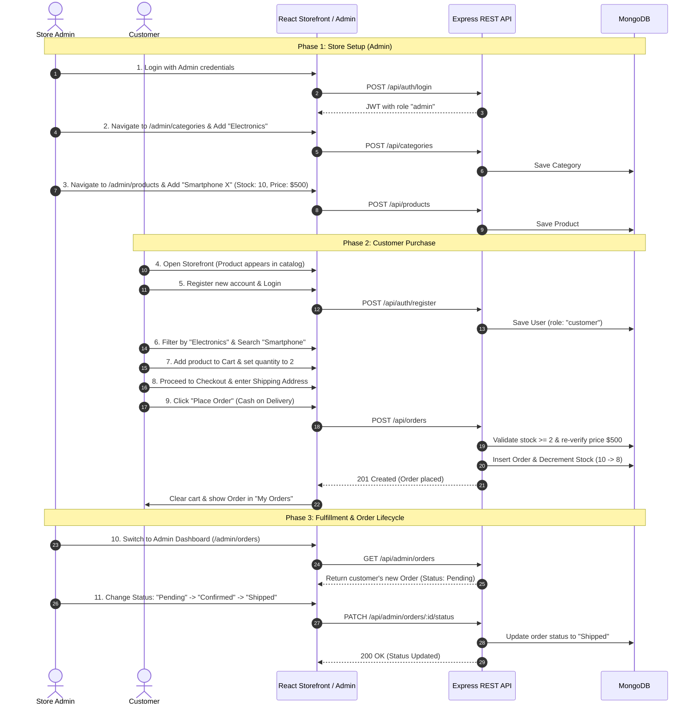

# 🎬 Main Demo Flow & Walkthrough Guide

This document provides a step-by-step demonstration walkthrough for the **Mini E-Commerce Demo Project**. It describes the complete user journey from administrative catalog setup to customer purchasing and fulfillment tracking.

---

## 🧭 Flowchart Overview

---

## 📋 Step-by-Step Walkthrough

### Step 1: Admin Authentication
1. Navigate to `/login`.
2. Enter default administrative credentials:
   - **Email**: `admin@ecommerce.com`
   - **Password**: `admin123`
3. Click **Sign In**.
4. **Result**:
   - The user is redirected to the `/admin/dashboard` or `/admin/products`.
   - The navigation bar renders the **Admin Panel** quick link and admin badge.

---

### Step 2: Create Product Categories
1. In the Admin Sidebar, click **Categories** (`/admin/categories`).
2. Click **+ Add Category**.
3. In the modal, input:
   - **Name**: `Electronics`
   - **Description**: `Smartphones, audio, and personal electronics.`
4. Click **Save Category**.
5. Repeat to create additional categories: `Fashion`, `Shoes`.
6. **Result**: Categories appear in the table and are immediately selectable in the product form and storefront filter bar.

---

### Step 3: Add New Products with Stock
1. In the Admin Sidebar, click **Products** (`/admin/products`).
2. Click **+ Add Product**.
3. Fill out the product form:
   - **Name**: `Ultra HD Wireless Headphones`
   - **Category**: Select `Electronics`
   - **Price**: `199.99`
   - **Stock**: `10`
   - **Image URL**: `https://images.unsplash.com/photo-1505740420928-5e560c06d30e`
   - **Description**: `Studio-grade noise cancelling headphones with 40h battery.`
4. Click **Create Product**.
5. **Result**: The product is created with an initial inventory of 10.

---

### Step 4: Verification on Public Storefront
1. Click **View Store** in the sidebar or navigate to `/products`.
2. Notice the newly created `Ultra HD Wireless Headphones` card visible in the grid.
3. Observe the green badge: **In Stock (10 left)**.

---

### Step 5: Customer Registration & Login
1. Click **Logout** from the admin session (or open an incognito window).
2. Navigate to `/register`.
3. Input new customer details:
   - **Name**: `Jane Doe`
   - **Email**: `jane@example.com`
   - **Password**: `customer123`
   - **Confirm Password**: `customer123`
4. Click **Create Account**.
5. **Result**: Auto-logged in as customer `Jane Doe` with standard `customer` role.

---

### Step 6: Browse, Filter, and Search
1. On the `/products` page:
   - Click the **Electronics** filter pill: Only electronics are displayed.
   - Enter `Headphones` in the search bar: Live filter narrows down matching items.
2. Click on the product card to view the **Product Details Page** (`/products/:id`).

---

### Step 7: Cart Manipulation & Stock Guard
1. On the product page, set quantity to `2`.
2. Click **Add to Cart**. Toast notification confirms: *"Added 2 items to your cart"*.
3. Click the Cart icon in the navbar (`/cart`).
4. In the cart view:
   - Attempt to click `+` until quantity exceeds available stock (10).
   - Observe that the button disables once quantity hits `10` with a warning tooltip.
   - Adjust quantity to `2`.
   - Total updates to `$399.98`.

---

### Step 8: Checkout & Order Placement (COD)
1. In the cart, click **Proceed to Checkout** (`/checkout`).
2. Fill out the shipping destination:
   - **Name**: `Jane Doe`
   - **Phone**: `9876543210`
   - **Address**: `Flat 402, Sunset Boulevard`
   - **City**: `Springfield`
   - **Pincode**: `700001`
3. Payment method indicates **Cash on Delivery (COD)**.
4. Click **Place Order**.
5. **Result**:
   - Backend performs atomic stock decrement (`10 - 2 = 8`).
   - Order is recorded with status `Pending`.
   - Cart is automatically cleared.
   - User is redirected to `/my-orders`.

---

### Step 9: Customer Checks "My Orders"
1. View `/my-orders`.
2. The newly placed order is listed with:
   - Unique Order ID
   - Order Date
   - Status badge: `Pending` (amber)
   - Ordered item: `Ultra HD Wireless Headphones x 2`
   - Total Amount: `$399.98`
   - Payment method: `Cash on Delivery`.

---

### Step 10: Admin Order Fulfillment & Status Update
1. Sign back in as Admin (`admin@ecommerce.com`).
2. Navigate to `/admin/orders`.
3. Locate Jane Doe's order at the top of the table.
4. Inspect the order details modal (items, shipping address).
5. In the status dropdown, transition the order:
   - From `Pending` ➔ `Confirmed`
   - From `Confirmed` ➔ `Shipped`
6. Return to customer view (`/my-orders`) or refresh:
   - Notice the status badge has updated to `Shipped` (indigo).
7. Return to `/admin/products`:
   - Verify stock for `Ultra HD Wireless Headphones` now reflects `8` remaining.

---

## 🎯 Verification Test Checklist

| Check # | Test Scenario | Expected Outcome |
| :---: | :--- | :--- |
| **TC-01** | Admin login with non-admin credentials | Access to `/admin` routes denied (HTTP 403 Forbidden) |
| **TC-02** | Add Category with empty name | Validation error displayed; creation rejected |
| **TC-03** | Add Product with negative price or negative stock | Server rejects with HTTP 400 |
| **TC-04** | Client submits manipulated lower price in order payload | Server ignores client price; calculates total from database |
| **TC-05** | Order quantity exceeding remaining stock | Order rejected with "Insufficient stock" error |
| **TC-06** | Successful order placement | Inventory stock automatically decremented in MongoDB |
| **TC-07** | Admin updates order status to Shipped | Real-time status badge change reflected in customer's My Orders |
