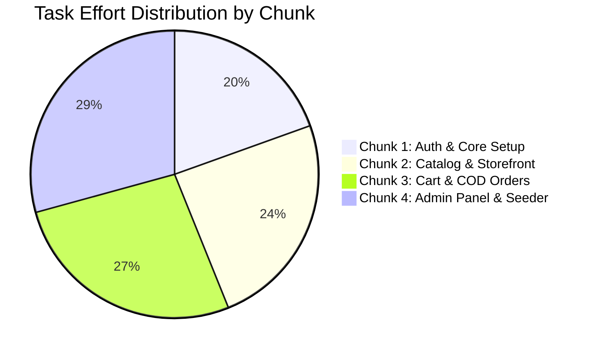

# 📋 Task Assignments & Chunked Work Breakdown Structure

This document provides a randomized chunk distribution of all 14 project tasks for the **Mini E-Commerce Demo Project (MERN Stack)**. Tasks are bundled into cohesive, independent chunks to prevent merge conflicts and enable parallel sprint execution.

---

## 🎲 Randomized Chunk Distribution



### Summary Matrix

| Chunk ID | Package Title | Included Tasks | Total Est. | Primary Assignee | Backup / Reviewer |
| :--- | :--- | :--- | :--- | :--- | :--- |
| **CHUNK-A** | 🔐 **Auth & Foundation** | TASK-01, TASK-02, TASK-07, TASK-08 | 10 hrs | `@Shreya-Sharma4` | `@kedar1330` |
| **CHUNK-B** | 🛍 **Catalog & Storefront** | TASK-03, TASK-04, TASK-09 | 10 hrs | `@kedar1330` | `@Shreya-Sharma4` |
| **CHUNK-C** | 🛒 **Cart & COD Checkout** | TASK-05, TASK-10, TASK-11 | 11 hrs | `@Shreya-Sharma4` | Collaborator 3 |
| **CHUNK-D** | 📊 **Admin Panel & Seeder** | TASK-06, TASK-12, TASK-13, TASK-14 | 12 hrs | `@kedar1330` | Collaborator 4 |

*(Note: If you have more team members, see the [Flexible Team Mapping](#-flexible-team-mapping) section below).*

---

## 📦 Detailed Chunk Breakdown & Specifications

### 🧩 CHUNK-A: Authentication & Core Architecture (Lead: `@Shreya-Sharma4`)
> **Goal**: Establish server infrastructure, MongoDB connection, Vite client setup, and end-to-end JWT auth flow.

* **TASK-01**: Express Server, MongoDB Connection & Error Middleware
  - Setup `server/server.js`, CORS, express JSON parser.
  - Connect to MongoDB via Mongoose with connection failure handling.
  - Global async error handling middleware & 404 catch-all.
* **TASK-02**: User Model, JWT Authentication & Role Middlewares
  - `User` schema (`name`, `email`, `password`, `role`).
  - Pre-save bcrypt hashing (10 salt rounds).
  - `POST /api/auth/register` & `POST /api/auth/login`.
  - `authMiddleware` (Bearer token check) & `adminMiddleware` (`role === "admin"`).
* **TASK-07**: Vite + React Setup & Tailwind Design Tokens
  - Scaffold Vite React inside `client/`.
  - Configure `tailwind.config.js` with indigo/slate color palette.
  - Setup base `index.css` and `MainLayout.jsx`.
* **TASK-08**: AuthContext, Token Storage, Protected Routes & Axios Setup
  - Centralized `api/axios.js` with Bearer token request interceptor.
  - Global `AuthContext.jsx` (`user`, `token`, `login`, `register`, `logout`).
  - `UserProtectedRoute` and `AdminProtectedRoute` route wrapper components.
  - Responsive `Login.jsx` and `Register.jsx` pages with toast alerts.

---

### 🧩 CHUNK-B: Categories, Products & Public Catalog (Lead: `@kedar1330`)
> **Goal**: Deliver category and product REST endpoints and a responsive public storefront.

* **TASK-03**: Category Model & CRUD REST Endpoints
  - `Category` schema (`name`, `description`).
  - Public `GET /api/categories`.
  - Admin-protected `POST`, `PUT`, `DELETE /api/categories/:id`.
* **TASK-04**: Product Model, CRUD Endpoints & Search/Filter API
  - `Product` schema (`name`, `description`, `price`, `image`, `category`, `stock`).
  - Filterable `GET /api/products?category=<id>&search=<query>`.
  - Admin-protected product CRUD operations.
  - Positive price (`> 0`) and non-negative stock (`>= 0`) validation.
* **TASK-09**: Public Storefront: Navbar, Responsive Grid & Search/Filter
  - `Navbar.jsx` with logo, real-time debounced search bar, category pills, cart counter.
  - `Products.jsx` product catalog grid with cards.
  - Stock badge indicators (`In Stock`, `Only X left`, `Out of Stock`).
  - Category selector pills (`All`, `Electronics`, `Fashion`, `Shoes`).

---

### 🧩 CHUNK-C: Shopping Cart & Cash on Delivery Orders (Lead: `@Shreya-Sharma4`)
> **Goal**: Implement client-side cart logic with stock boundary protection and server-side COD order fulfillment.

* **TASK-05**: Order Model, Server-side Stock/Price Validation & COD API
  - `Order` schema (`user`, `products`, `totalAmount`, `shippingAddress`, `status`, `paymentMethod`).
  - `POST /api/orders`:
    - Re-query MongoDB for actual product prices (never trust frontend price).
    - Validate sufficient stock (`stock >= qty`).
    - Atomically decrement product stock.
    - Save order with status `Pending`.
  - `GET /api/orders/my-orders`: Retrieve logged-in customer's order history.
* **TASK-10**: Product Details Page, CartContext & Stock-Bounded Quantity Logic
  - `CartContext.jsx` with `addToCart`, `updateQuantity`, `removeFromCart`, `clearCart`.
  - Strict stock cap: cart quantity cannot exceed available product inventory.
  - `ProductDetails.jsx` page with full image, description, and quantity controls.
  - `Cart.jsx` page with item breakdown, total calculation, and "Proceed to Checkout".
* **TASK-11**: COD Checkout Form, Order Creation Flow & My Orders Page
  - `Checkout.jsx` form: Name, Phone, Address, City, Pincode.
  - Fixed payment method: "Cash on Delivery".
  - Order submission: call `POST /api/orders`, clear cart upon success.
  - `MyOrders.jsx` page displaying customer order history with status badges.

---

### 🧩 CHUNK-D: Admin Dashboard, Seeder & Order Lifecycle (Lead: `@kedar1330`)
> **Goal**: Build the administrative panel for managing catalog, tracking orders, and updating status.

* **TASK-06**: Database Seeder Script (`server/utils/seeder.js`)
  - Standalone script to reset DB and seed initial admin, customer, categories, and products with images.
  - Command: `npm run seed`.
* **TASK-12**: Admin Dashboard Shell, Sidebar & Admin Route Protection
  - `AdminLayout.jsx` with responsive sidebar navigation (`Categories`, `Products`, `Orders`, `Exit to Store`).
  - Summary metrics cards (Total Categories, Products, Orders, Revenue).
  - Protected by `AdminProtectedRoute`.
* **TASK-13**: Admin Category & Product Management Tables with Modals
  - `AdminCategories.jsx` table with add/edit modal and delete confirmation dialog.
  - `AdminProducts.jsx` table with thumbnail, stock badge, category pill, edit modal, delete confirmation.
* **TASK-14**: Admin Order Fulfillment Panel & Status Update Workflow
  - `AdminOrders.jsx` displaying all customer orders.
  - Order details modal showing shipping address and ordered products list.
  - Status change dropdown: `Pending` ➔ `Confirmed` ➔ `Shipped` ➔ `Delivered` (or `Cancelled`).
  - PATCH request to `/api/admin/orders/:id/status`.

---

## 👥 Flexible Team Mapping

If your team has a different number of collaborators, use these chunk distributions:

### For a 2-Person Team:
- **Collaborator 1 (`@Shreya-Sharma4`)**: **Chunk A** (Auth & Core) + **Chunk C** (Cart & Orders)
- **Collaborator 2 (`@kedar1330`)**: **Chunk B** (Catalog & Storefront) + **Chunk D** (Admin & Seeder)

### For a 3-Person Team:
- **Collaborator 1**: **Chunk A** (Auth & Core) + **Chunk D (Seeder & Stats)**
- **Collaborator 2**: **Chunk B** (Catalog & Storefront)
- **Collaborator 3**: **Chunk C** (Cart & Orders) + **Chunk D (Admin Tables & Status)**

### For a 4-Person Team:
- **Collaborator 1**: **Chunk A**
- **Collaborator 2**: **Chunk B**
- **Collaborator 3**: **Chunk C**
- **Collaborator 4**: **Chunk D**

---

## 🚀 Creating Chunked GitHub Issues via Script

All 4 chunked epic issues (or the individual 14 task issues) can be batch-created directly on GitHub using the provided script in `scripts/`:

```bash
# Push chunked epic issues to GitHub
node scripts/create_chunked_issues.js <YOUR_GITHUB_TOKEN>
```
